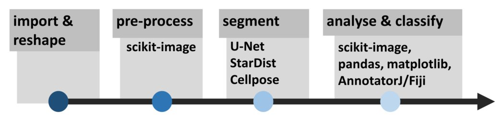
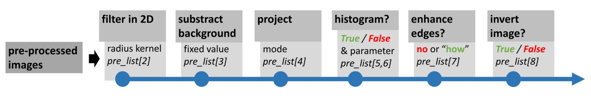
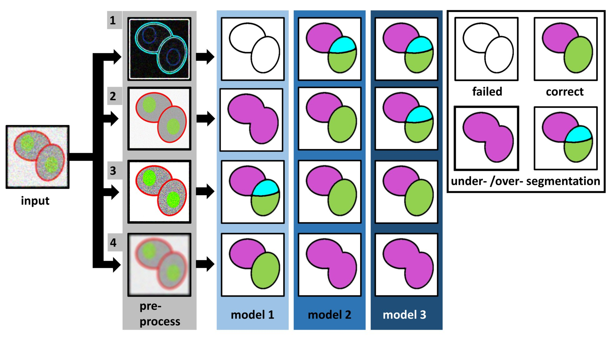
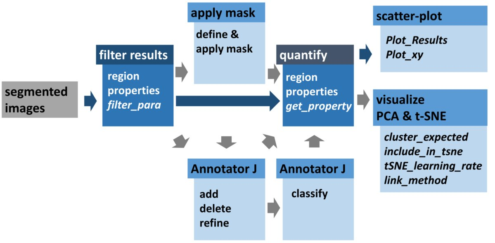
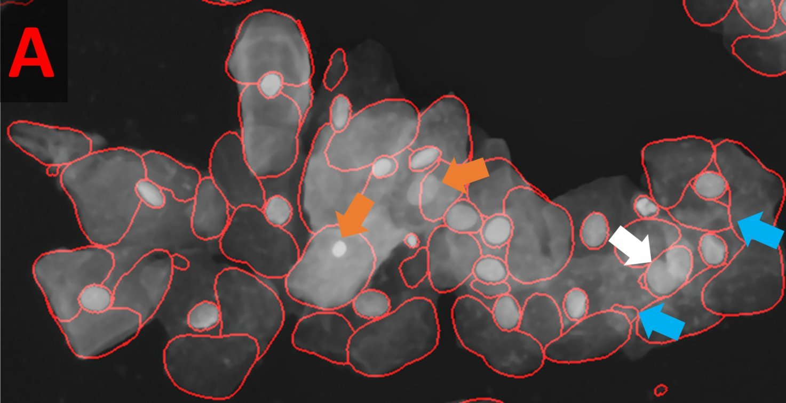
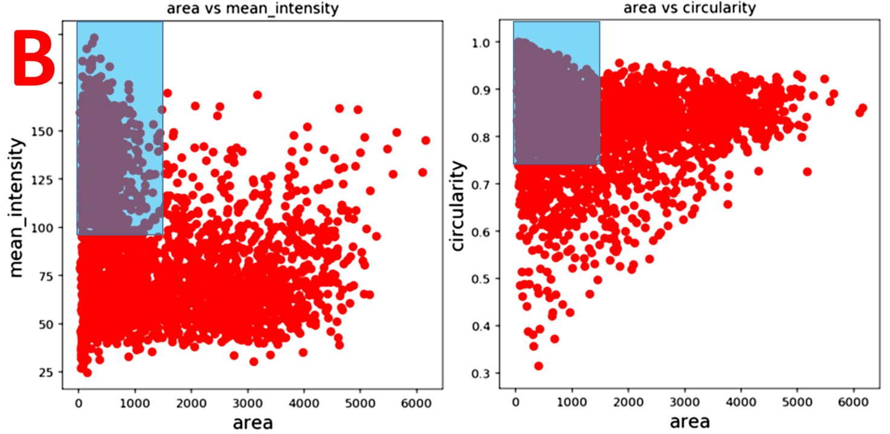
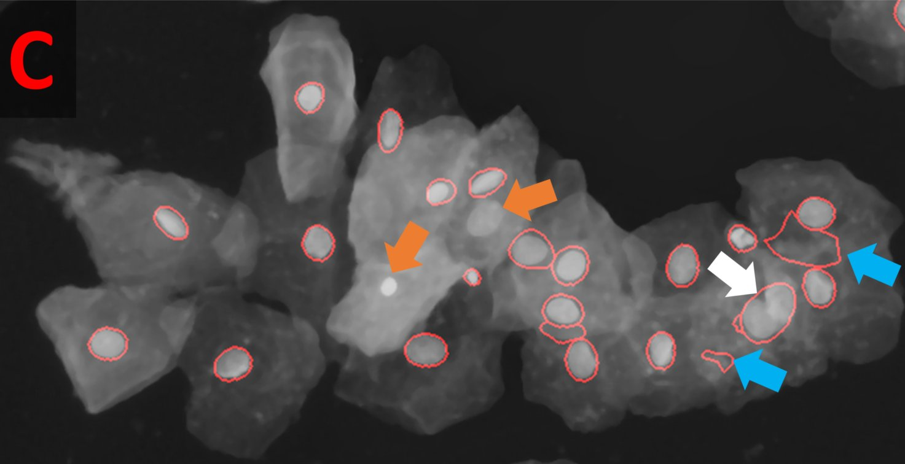
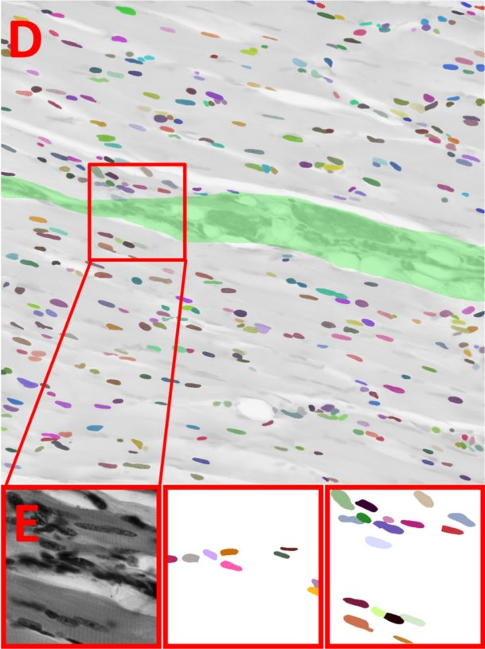
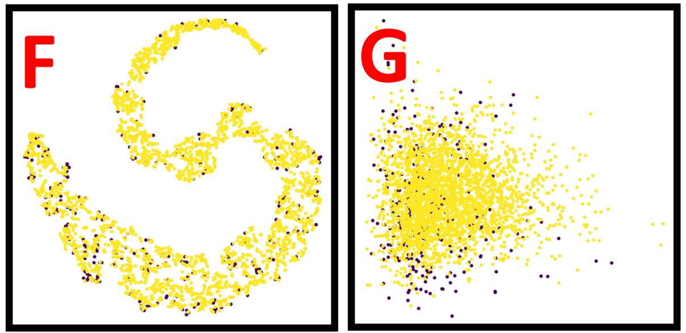

## Summary

Various pre-trained deep-learning models for the segmentation of biomedical images have been made available to users with little to no knowledge in machine learning. However, testing these tools individually is tedious and success is uncertain. Pre-trained models might fail, because the convolutional neural network (CNN) was trained on data that does not resemble the new images well. Alternatively, the underlying CNN- architecture might not be suited for the presented task. Inexperienced Biomedical users with no background in computer science are often unable to distinguish these two possibilities and might erroneously conclude that their problem is in principle not suited for CNN-based segmentation. Thus, they might hesitate to create annotations to retrain the most appropriate CNN-architecture. 

Here, we present OpSeF, a Python framework for deep-learning based semantic segmentation that was developed to promote the collaboration of biomedical user with experienced image-analysts. for experienced image-analysts. The performance of pre-trained models can be improved by using pre-processing to make the new input data more closely resemble the data the selected models were trained on. OpSeF assists analysts with the semi-automated exploration of different pre-processing parameters. OpSeF integrates in a single framework: scikit-image, a collection of Python algorithms for image processing, and three mechanistically distinct CNN-based segmentation methods, the U-Net implementation used in Cellprofiler 3.0, StarDist, and Cellpose. The optimization of parameters used for preprocessing and selection of a suitable model for segmentation form one functional unit. Even if sufficiently good results are not achievable with this approach, OPSEF results can inform the analysts in the selection of the most promising CNN-architecture in which to the biomedical user might invest the effort of manually labeling training data. 

We provide two generic non-microscopy image collections to illustrate common segmentation challenges. Further datasets exemplify the segmentation of a mono-layer of fluorescent cells, fluorescent tissue, cells in which various compartments have been stained with a single dye, as well as histological sections stained with one or two dyes. These notebooks are intended for to support analystst in their teaching and as a template for a their systematic search for the best combination of preprocessing and CNN-based segmentation. Results can be analyzed and visualized using matplotlib, pandas, scikit-image, and scikit-learn. They can be refined by object-selection based on their region properties, a biomedical-user-provided or an auto-generated mask. Additionally, results might be exported to AnnotatorJ for editing or classification in ImageJ. After refinement, the analyst results can be re-imported results and further analyze themd in OpSeF. 

We hope that OpSeF biomedical users will provide further image collections, analystst Jupyter notebooks, and pre-trained models. Thereby, OpSeF might soon become, both a “model store”, in which appropriate model might be identified with reasonable effort and a valuable resource for teaching biomedical user CNN-based segmentation.


## Technical desription 

OpSeF has been primarily developed for staff image analysts with solid knowledge in image analysis, thorough understating of the principles of machine learning, and ideally basic skills in Python. 

The analysis pipeline consists of four principal sets of functions to *import and reshape* the data, to *pre-process* it, to *segment* objects, and to *analyze and classify* results. 



Currently, OpSeF can process individual tiff-files and the Leica “.lif” container file format. During *import and reshape,* the following options are available for tiff-input: *tile* in 2D and 3D, *scale*, and make *sub-stacks* . For lif-files, only the make *sub-stacks* option is supported. 

Pre-processing is mainly based on scikit-image. It consists of a linear pipeline: 



Images are filtered in 2D, background is removed, and then stacks are projected. Next, the following optional pre-processing operations might be performed: histogram adjustment, edge enhancement, and inversion of images. 

Segmentation in cooperates the pre-trained U-Net implementation used in Cellprofiler 3.0, the StarDist 2D model and Cellpose. 

Importantly, OpSeF is designed such that parameters for pre-processing and selection of the ideal model for segmentation are one functional unit. 



Left panel: Illustration of a processing pipeline, in which three different models are applied to data generated by four different pre-processing pipelines each. Right panel: Resulting images are classified into results that are correct; suffer from under- or over-segmentation or fail to detect objects. 


## How to get started:

1) Clone repository

2) Download data from https://owncloud.gwdg.de/index.php/s/nSUqVXkkfUDPG5b

3) Setup environment

4) Execute OpSeF_IV_Configure_001.ipynb (only once after installation)

5) Open any "Basic" demo notebook

6) Define the path, where you put the data (see QuickStart.pdf) and execute notebook

7) Copy this file-path of the .pkl file (see QuickStart.pdf)

8) Open OpSeF_IV_Run_001.ipynb and point the variable file_path to the .pkl file generated in 7) 

​     (see QuickStart.pdf)

Link to QuickStart.pdf: 

[QuickStart.pdf](./Documentation/Quick_Start_OpSeF.pdf)


## Advanced Use:

#### Define your own project:

1) Copy an existing Demo Notebook

2) Organize all input data in one folder

*using .lif as input:*

​	root/myimage_container.lif

*using .tif as input:*

​	root/tiff/myimage1.tif (in case this folder is the direct input to the pre-processing pipeline)

​	root/tiff/myimage2.tif ...

​	root/tiff_raw_2D/myimage1.tif (if you want to make patches in 2D)

​	root/tiff_to_split/myimage1.tif (if you want ONLY create substacks, no binning or creation of patches) 

​	root/tiff_raw/myimage1.tif (for all pipelines that start with patching or binning and use stacks)

3) Point Demo Notebook to this folder & give notebook a common name:

```python
input_def["root"] = "/home/trasse/Desktop/MLTestData/leaves"
input_def["dataset"] = "leaves"
```

4) Define input type

```python
input_def["input_type"] = ".tif"
```

5) Define first test run (give it a Run_ID, define pre-processing & which model to test)

```python
run_def["run_ID"] = "001"  # give each run a new ID 
                           #(unless you want to overwrite the old data)

run_def["pre_list"] = [["Median",3,50,"Max",False,run_def["clahe_prm"],"no",False],
                       ["Median",3,50,"Max",True,run_def["clahe_prm"],"no",False],
                       ["Median",3,50,"Max",False,run_def["clahe_prm"],"sobel",False],
                       ["Median",3,50,"Max",False,run_def["clahe_prm"],"no",True]]

# For Cellpose
run_def["rescale_list"] = [0.2,0.4,0.6] # run1

# Define model
run_def["ModelType"] = ["CP_nuclei","CP_cyto","SD_2D_dsb2018","UNet_CP001"] # run1
```

6) Execute Run in OpSeF_IV_Run_001.ipynb (as described for the demo notebooks)

### Explore Post-Processing Options:

Segmented objects can be filtered by their region properties or a mask, results might be exported to AnnotatorJ and re-imported for further analysis. Blue arrows define the default processing pipeline, grey arrows feature available options. Dark Blue boxes are core components, light blue boxes are optional processing steps.




Explore the Demo Notebook: OpSeF_IV_Setup_Advanced_Filter_Plot_CSV_to_Fiji_0001_SDB_EpiCells.

This notebook illustrates how results can be improved by simple filtering.

StarDist segmentation of the Multi-labeled Cells Datasets detected nuclei reliably but caused many false positive detections. These resembles the typical shape of cells but are larger than true nuclei. Orange arrows point at nuclei that were missed, the white arrow at two nuclei that were not split, the blue arrows at false positive detection that could not be removed by filtering. 



Scatter plot of segmentation results shown in A. Left panel: Mean intensity plotted against area. Right panel: Circularity plotted against area. Blue Box illustrating parameter used to filter results. 



Filtered Results. Orange arrows point at nuclei that were missed, the white arrow at two nuclei that were not split, the blue arrows at false positive detection that could not be removed by filtering.




Explore the Demo Notebook:

OpSeF_IV_Setup_Advanced_User_Mask_Cluster_Plot_CSV_toFiji_0002dev_SkeletalMuscle_mask
This notebook illustrates the use of a user provided mask.

!! Execute the parameter from this Notebook in OpSeF_IV_Run_002_dev.ipynb !!



(D,E) Example for the use of a user provided mask to classify segmented objects. The segmentation results (false colored nuclei) are is superimposed onto the original image subjected to [median 3x3] preprocessing. All nuclei located in the green area assigned to Class 1, all others to Class 2. Red box indicates region shown enlarged in (E). From left to right in E: original image, nuclei assigned to class 1, nuclei assigned to class 2. 

T-distributed Stochastic Neighbor Embedding (t-SNE) analysis and Principal component analysis (PCA) were used to whether there is a difference between the two classes. Nuclei are not clustered by their color-coded class (class 1 (purple), class 2 (yellow)).

To this aim the pc["Do_ClusterAnalysis"] has to be set to True and
```python
if pc["Do_ClusterAnalysis"]: # Define (below) which values will be included in the TSNE:
    pc["Cluster_How"] = "Mask" # or "Mask"
```



(F) (t-SNE) analysis of nuclei assigned to class 1 (purple) or class 2 (yellow). 
(G) PCA of nuclei assigned to class 1 (purple) or class 2 (yellow).

### Export to and Import from AnnotatorJ (coming soon)


### Further Information:

Documentation of naming schemes used: 

guide_to_folder_structure_and_file_naming.txt

Documentation of main variables used: 

guide_to_variables.txt

Further Questions:

see FAQ :

[FAQ](./Documentation/FAQ.pdf)

Guide how to create masks for classification:
Guide_user_provided_masks.txt

## Common Issues


## Why & How to Contribute

Many ML-based segmentation tools can be classified as "developer to end-user" solution. The number of parameter accessible to the end-user is very limited. Often these tools are promoted with statements such as "no knowledge in machine learning required". 

OpSeF follows a different approach. Using it without basic knowledge in machine learning and the desire to dive deeper into possibilities for optimization will most likely lead to frustration (and is thus discouraged).

OpSeF is designed as "image analyst to image analyst"  project.

OpSeF allows for straightforward integration of large number of pre-trained model. We hope that OpSeF will be widely accepted as frame-work through which novel model can be made available to other image analysts. 

At current OpSeF-IV is still at the  prove of concept stage and contains currently only four pre-trained model & the to-do list is long.

It will reach it's full potential only by being transformed into a community project.

Thus, if you lack a feature, please try to add it yourself.

Please find the current to-do list here: 

[To Do](./To_Do/to_do.txt)

Please consider to solve one of these tasks.

If you train new model, please make them available in OpSeF.

Hopefully, we will publish the OpSeF-XL update (with 40 pre-trained model instead of 4) within a year as a community paper.

Please contribute new Demo_Notebooks & teaching material.

If you get stuck please e-mail me & I will try to troubleshoot.

Then please consider to multiply you knowledge by volunteering to help other analysts in using and developing OpSeF.  


